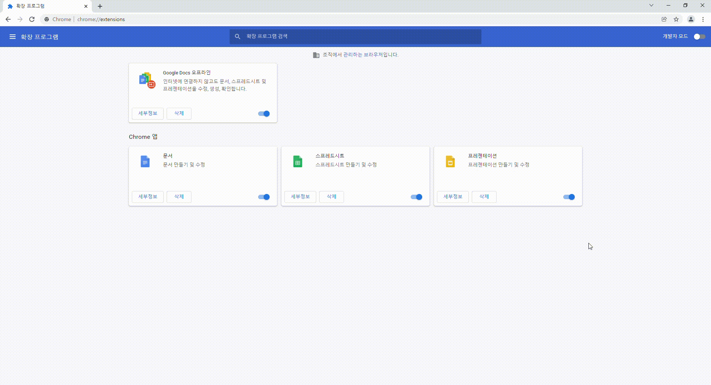
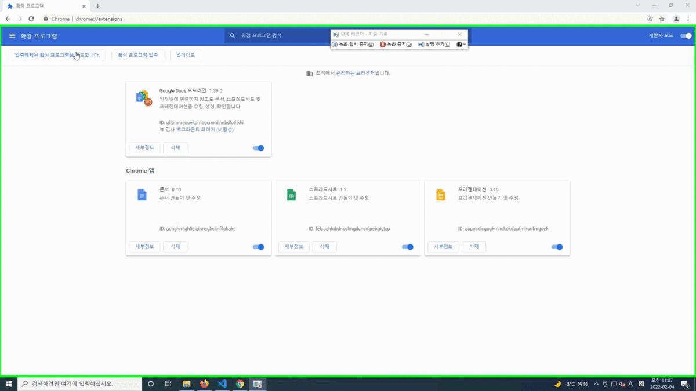

# 크롬 네이버 뉴스 수집 확장기능

네이버 뉴스 사이트("https://search.naver.com/","https://news.naver.com/")에서만 작동.  

## 다운로드 방법
1. 아래 짤과 같이 왼쪽 위 클릭 후 Zip파일 다운로드
   
2. 압축해제
3. 크롬 열기
4. [chrome://extensions](chrome://extensions) 접속
5. 아래 짤과 같이 개발자 모드 활성화
   
6. 압축 해제한 파일 불러오기
   
7. 작동하는지 확인